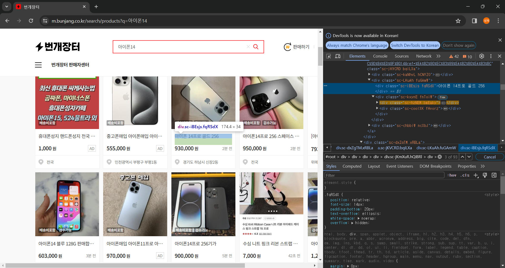
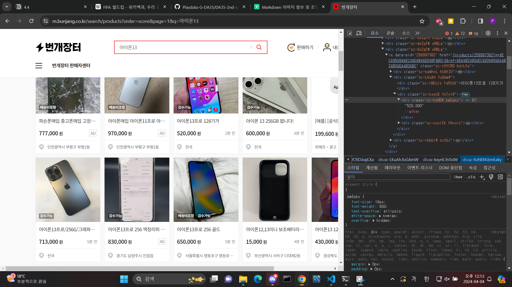
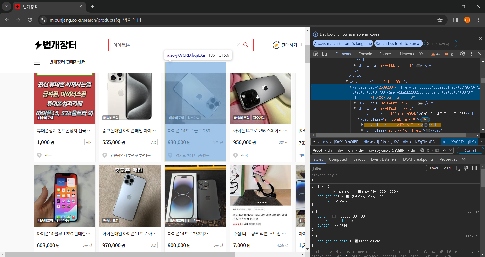

# **iPhone Market Data Exploration Report**

## **Data Structure of Bunjang**

This project utilizes data from the second-hand trading platform **Bunjang**.  

  
*Title selector*  

  
*Price selector*  

  
*Link selector. Unlike text-based attributes, link information was extracted by retrieving the `href` value of the corresponding selector.*  

  

## **Challenges Faced**

### **1. Choosing a Web Scraping Method**  
For web scraping, both the `requests` module and the `selenium` module were considered. Initially, I attempted both approaches. The advantage of using the `requests` module is that it can be combined with `asyncio` to write asynchronous code, which significantly increases scraping speed and improves user experience.  

However, **Bunjang is built using JavaScript**, meaning it loads data asynchronously. This makes scraping with `requests` ineffective, as the necessary data is not available in the initial HTML response. Unfortunately, I overlooked this when writing the initial code, leading to a significant waste of time.  

Ultimately, I used `selenium` to scrape data, but I was unable to overcome the **slow speed** issue. This was particularly problematic in `product_comparison.py`, where three different products were compared by fetching data from **30 URLs**, making the program execution time quite long.  

### **2. Data Collection Limitations**  
The scraped data includes the **title, price, and product link**, but I encountered difficulties in extracting additional details. On Bunjang’s listing pages, only **product images, titles, and prices** are available. To obtain more details, such as **product condition, exchange availability, and shipping fees**, I would need to scrape data from individual product pages.  

Since the project was built using `selenium`, scraping data from individual product pages would have **exponentially increased execution time**. As a result, `market_scraper.py` was designed to collect only three pieces of information (**title, price, and link**), which was somewhat limiting.  

### **3. Object-Oriented Programming Challenges**  
Writing **object-oriented code** was another challenge. I was initially unfamiliar with structuring code using **classes and methods**, leading to a longer development time. At first, I wrote the code **procedurally**, but this made `product_comparison.py` increasingly complex.  

Refactoring the scraper into a **class-based structure (`MarketInfoScraper`)** significantly improved code readability and organization.  

---

## **Project Implementation**

### **market_scraper.py**

The scraping process was implemented using `selenium` with the **headless** option enabled. The `start_browser` and `stop_browser` methods handle **browser initialization and termination**.  

Once connected to the browser, the `scrape_market_info` method iterates over **10 listing pages** by modifying URL parameters, extracting the **title, price, and link** based on class names, and storing them in a Pandas DataFrame.  

To filter out irrelevant data, only products priced **between 200,000 KRW and 2,000,000 KRW** were included in the dataset.  

The cleaned DataFrame is saved as a **CSV file** in the user’s directory using the `save_market_info_csv` method.  

The `plot_price_distribution` method uses `matplotlib` to generate a **price distribution graph**, with **price on the x-axis** and **quantity on the y-axis**, providing an intuitive visualization for users.  

Through these methods in the `MarketInfoScraper` class, the **main function** enables users to enter the iPhone model and storage capacity, after which the script scrapes the relevant data and stores both the **market information CSV file and the visualization graph** in the `market_info` directory.  

---

### **product_comparison.py**

This script uses the `MarketInfoScraper` class to **compare and visualize the prices of three different iPhone models** in a single graph.  

